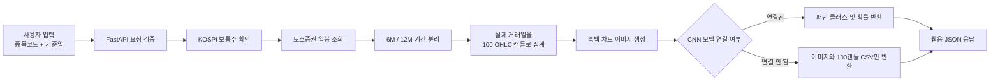

## 📌 Introduce
복잡한 주식 시장의 시계열 데이터를 컴퓨터 비전(CNN) 기술로 판독하여 추세의 변곡점을 짚어내고, LLM(거대 언어 모델)을 활용하여 지금 당장 주목해야 할 실시간 투자 정보를 알기 쉽게 브리핑하는 종합 금융 AI 플랫폼입니다.

<br/>

## ✨ Core Features

### 👁️‍🗨️ CNN 기반 차트 형상 판독 
단순한 보조지표 계산을 넘어, 인간의 눈으로 차트를 분석하는 방식을 AI로 구현했습니다.
* **이미지 변환 파이프라인:** OHLCV 시계열 데이터를 노이즈가 제거된 캔들스틱 차트 이미지로 정밀하게 변환(도해)합니다.
* **패턴 자동 분류:** 변환된 이미지를 CNN 모델에 입력하여 '헤드앤숄더', '이중 천장', '박스권' 등 강력한 하락/상승 징후를 자동 분류합니다.
* **일일 스캐닝 시스템:** 매일 장 마감 후 코스피 주요 종목의 데이터를 스크래핑하여 즉각적인 분석 결과를 도출합니다.


## 🛠️ Tech Stack

* **AI / ML:** PyTorch, Transformers, OpenCV, mplfinance
* **Data Pipeline:** Pandas, FinanceDataReader, pykrx
* **Backend:** FastAPI, Celery
* **Frontend:** React.js, Tailwind CSS
* **Infra:** AWS EC2, Docker

<br/>

## 📈 Architecture Flow

1. **Data Collection:** 매일 특정 시간, 타겟 주식 리스트의 정형 데이터를 수집합니다.
2. **Preprocessing:** 수집된 수치 데이터를 CNN 모델 입력에 적합한 2D 이미지 형태로 변환 및 정규화합니다.
3. **Inference (Vision):** 학습된 딥러닝 모델이 차트 패턴을 분류하고 확률(Confidence Score)을 계산합니다.
4. **Real-time Processing:** 실시간 뉴스 및 호가 데이터를 가져와 LLM이 투자 브리핑을 생성합니다.
5. **Serving:** REST API를 통해 웹 프론트엔드로 분석 결과와 브리핑을 송출합니다.

<br/>

<div align="center">
  <i>© 2026 Project Gaemi-Dohae. All rights reserved.</i>
</div>

<br/>

## 📊 Real Market Data Pipeline & On-Demand API

본 파트는 학습용 합성 차트와 실제 KOSPI 주가 데이터를 동일한 이미지 형식으로 변환하고, 사용자가 입력한 종목코드와 기준일을 바탕으로 6개월·12개월 차트를 동적으로 생성하는 역할을 담당합니다.

단순히 기존 차트 이미지를 업로드하는 방식뿐만 아니라, 사용자가 웹에서 종목코드와 기준일을 입력하면 서버가 토스증권 Open API를 통해 실제 일봉 데이터를 가져와 100캔들 흑백 이미지로 변환할 수 있도록 구성했습니다.

> 이 파이프라인은 토스증권의 종목·시세 데이터만 사용합니다.  
> 계좌, 잔고, 보유종목 및 주문 관련 API는 호출하지 않습니다.

---

## 🎯 담당 기능

- 토스증권 Open API 인증 및 실제 KOSPI 일봉 데이터 수집
- KOSPI ACTIVE 보통주 검증
- KOSDAQ, ETF, ETN, 우선주 제외
- KOSPI 시가총액 상위 500/400/300개 종목 구성
- 6개월·12개월 실제 거래일 구간 생성
- 각 기간의 OHLC 데이터를 정확히 100캔들로 집계
- 학습 데이터와 동일한 흑백 차트 이미지 생성
- 사용자 입력 기반 온디맨드 FastAPI 제공
- 동일 요청의 이미지·CSV·예측 결과 캐싱
- PyTorch CNN 모델 연결을 위한 추론 인터페이스 제공
- 웹 프론트엔드가 사용할 이미지 URL·JSON 응답 생성

---

## 🧭 전체 처리 흐름



---

## 🏢 데이터 수집 대상

### 시장 범위

다음 조건을 모두 만족하는 종목만 사용합니다.

| 조건 | 설정 |
|---|---|
| 시장 | KOSPI |
| 상장 상태 | ACTIVE |
| 증권 유형 | STOCK |
| 주식 종류 | 보통주 |
| 제외 대상 | KOSDAQ, ETF, ETN, 우선주 |
| 가격 데이터 | 수정 일봉 OHLC |
| 거래량 | 이미지 생성에 사용하지 않음 |

### 시가총액 상위 N개 선정

토스증권 API에서 제공하는 발행주식수와 현재가를 사용해 현재 시가총액을 다음과 같이 계산합니다.

```text
현재 시가총액 추정값 = 발행주식수 × 현재가
```

기본값은 상위 500개이며, 설정값 하나로 400개 또는 300개로 변경할 수 있습니다.

```python
TOP_N = 500  # 400 또는 300으로 변경 가능
```

> 여기서 사용하는 종목 목록은 실행 시점 현재의 상위 N개 종목입니다.  
> 과거 각 시점의 실제 시가총액 상위 종목 구성을 재현한 것은 아니므로 생존편향이 존재할 수 있습니다.

---

## 📅 기간 생성 기준

배치 생성과 사용자 요청 방식은 기간 계산 방법이 다릅니다.

| 실행 방식 | 6개월 구간 | 12개월 구간 |
|---|---|---|
| 배치 파이프라인 | 1~6월, 7~12월 | 1~12월 |
| 온디맨드 API | 사용자 기준일로 끝나는 이전 6개월 | 사용자 기준일로 끝나는 이전 12개월 |

### 온디맨드 요청 예시

사용자가 다음 값을 입력한 경우:

```text
종목코드: 005930
기준일: 2023-08-14
```

서버는 다음 구간을 생성합니다.

```text
6M  : 2023-02-15 ~ 2023-08-14
12M : 2022-08-15 ~ 2023-08-14
```

기간은 다음 규칙으로 계산합니다.

```text
시작일 + N개월 - 1일 = 종료일
```

기준일이 주말이나 휴장일이어도 요청 자체는 정상 처리됩니다. 이 경우 기준일 이전의 마지막 실제 거래일까지 사용합니다.

---

## 🕯️ 100캔들 변환 방식

6개월과 12개월의 실제 거래일 수는 서로 다르지만 CNN 모델에는 항상 동일한 크기의 입력이 필요합니다.

따라서 해당 기간 안에 존재하는 모든 실제 일봉을 시간순으로 나눈 뒤 정확히 100개의 연속 구간으로 집계합니다.

각 구간의 OHLC는 다음 규칙으로 계산합니다.

| 값 | 집계 방식 |
|---|---|
| Open | 구간 첫 번째 거래일의 시가 |
| High | 구간 내 최고가 |
| Low | 구간 내 최저가 |
| Close | 구간 마지막 거래일의 종가 |

예를 들어 12개월 구간에 실제 일봉이 249개 존재한다면, 249개의 관측값 전체를 순서대로 100개 구간에 배분해 100개의 OHLC 캔들로 변환합니다.

### 데이터 무결성 원칙

- 주말 행을 생성하지 않습니다.
- 휴장일 행을 생성하지 않습니다.
- 누락된 날짜를 가격 보간으로 채우지 않습니다.
- 미래 데이터를 사용하지 않습니다.
- 거래일 순서를 변경하지 않습니다.
- 각 구간의 실제 Open·High·Low·Close 관계를 유지합니다.
- 원본 일봉이 100개 미만이면 가짜 캔들을 만들지 않습니다.

신규 상장이나 장기 거래정지로 실제 일봉이 100개 미만이면 다음과 같이 반환합니다.

```json
{
  "status": "insufficient_data",
  "candles": 0,
  "message": "실제 거래일이 부족해 100캔들을 만들 수 없습니다."
}
```

---

## 🖼️ 차트 이미지 생성 규격

합성 학습 이미지와 실제 데이터 이미지의 도메인 차이를 줄이기 위해 다음 형식을 사용합니다.

| 설정 | 값 |
|---|---|
| 차트 유형 | Candlestick |
| 사용 데이터 | Open, High, Low, Close |
| 원본 캔들 수 | 정확히 100개 |
| 캔버스 크기 | 3 × 3 inch |
| DPI | 100 |
| 배경 | 흰색 |
| 캔들 색상 | 검은색 |
| 캔들 테두리 | 검은색 |
| 축 | 제거 |
| 눈금 | 제거 |
| 가격·날짜 텍스트 | 제거 |
| 격자 | 제거 |
| 저장 방식 | Tight Bounding Box |
| Padding | 0 |
| 최종 색상 모드 | Grayscale |
| CNN 입력 크기 | 224 × 224 |

실제 생성 PNG는 `bbox_inches="tight"` 설정에 따라 300×300보다 작게 저장될 수 있습니다. CNN 입력 단계에서 모든 이미지를 224×224로 Resize합니다.

시가 갭으로 캔들 사이가 시각적으로 끊겨 보이는 문제를 완화하기 위해 `전일 종가 → 다음 시가` 사이에 가는 검은 연결선을 표시합니다.

이 연결선은 시각화에만 사용되며 실제 OHLC 값은 변경하지 않습니다.

---

## ⚙️ 지원하는 두 가지 실행 방식

### 1. 전체 배치 생성

KOSPI 상위 N개 종목의 2016년 이후 데이터를 미리 생성하는 방식입니다.

```text
KOSPI 상위 N개 선정
    ↓
종목별 전체 일봉 수집
    ↓
완성된 6M·12M 기간 생성
    ↓
각 기간을 100캔들 이미지로 저장
    ↓
선택적으로 CNN 일괄 추론
```

배치 파이프라인은 다음 기능을 포함합니다.

- 상위 500/400/300개 설정
- 종목별 원본 일봉 캐시
- 종목별 체크포인트
- Colab 중단 후 이어서 실행
- 순위 스냅샷 고정
- 여러 실행 구간으로 분할 처리
- 전체 이미지 Manifest 생성
- 웹용 최신 예측 JSON 생성

500개 종목을 나누어 실행하는 예시는 다음과 같습니다.

```python
# 첫 번째 실행
RANK_START = 1
RANK_END = 100

# 다음 실행
RANK_START = 101
RANK_END = 200
```

같은 출력 폴더를 사용하면 완료된 종목은 자동으로 건너뜁니다.

### 2. 온디맨드 API

사용자가 웹에서 종목코드와 기준일을 입력할 때 필요한 이미지만 생성하는 방식입니다.

```text
POST /v1/analyze
```

요청 예시:

```json
{
  "symbol": "005930",
  "asOf": "2023-08-14",
  "periods": [6, 12],
  "predict": false
}
```

`symbol`은 문자열 `"005930"`을 권장하지만 `"5930"` 또는 숫자 `5930`을 보내도 서버가 `005930`으로 보정합니다.

---

## 🌐 REST API

### API 목록

| Method | Endpoint | 설명 |
|---|---|---|
| `GET` | `/health` | API 서버 및 CNN 모델 상태 확인 |
| `GET` | `/docs` | Swagger API 테스트 화면 |
| `POST` | `/v1/analyze` | 종목코드·기준일 기반 6M/12M 분석 |
| `GET` | `/v1/images/{symbol}/{date}/{period}.png` | 생성된 흑백 차트 이미지 |
| `GET` | `/v1/candles/{symbol}/{date}/{period}.csv` | 집계된 100캔들 OHLC CSV |

### 이미지 생성만 수행

CNN 모델을 연결하지 않은 상태에서는 `predict`를 `false`로 지정합니다.

```json
{
  "symbol": "005930",
  "asOf": "2023-08-14",
  "periods": [6, 12],
  "predict": false
}
```

### 이미지 생성 후 CNN 분류 수행

학습된 CNN 모델이 서버에 연결된 경우 다음과 같이 요청합니다.

```json
{
  "symbol": "005930",
  "asOf": "2023-08-14",
  "periods": [6, 12],
  "predict": true
}
```

> `predict: true`라고 설정해도 모델 파일이 자동으로 생성되거나 학습되는 것은 아닙니다.  
> 학습 완료 모델과 클래스 매핑이 서버에 준비되어 있어야 합니다.

### 응답 예시

```json
{
  "requestId": "0a66721c6d266861",
  "symbol": "005930",
  "name": "삼성전자",
  "market": "KOSPI",
  "asOf": "2023-08-14",
  "requestedPeriods": ["6M", "12M"],
  "targetCandles": 100,
  "adjusted": true,
  "cached": false,
  "results": [
    {
      "period": "6M",
      "periodStart": "2023-02-15",
      "periodEnd": "2023-08-14",
      "firstTradingDay": "2023-02-15",
      "lastTradingDay": "2023-08-14",
      "sourceBars": 126,
      "candles": 100,
      "status": "ok",
      "imageUrl": "http://localhost:8000/v1/images/005930/2023-08-14/6M.png",
      "candleUrl": "http://localhost:8000/v1/candles/005930/2023-08-14/6M.csv",
      "prediction": null
    }
  ]
}
```

### CNN 연결 시 예측 응답

```json
{
  "prediction": {
    "predictedIndex": 10,
    "predictedLabel": "헤드앤숄더",
    "confidence": 0.91,
    "topK": [
      {
        "rank": 1,
        "index": 10,
        "label": "헤드앤숄더",
        "confidence": 0.91
      },
      {
        "rank": 2,
        "index": 12,
        "label": "쌍봉",
        "confidence": 0.06
      }
    ]
  }
}
```

---

## 🧠 CNN 모델 연결 기준

학습 노트북에서 사용한 모델 설정은 다음과 같습니다.

| 항목 | 설정 |
|---|---|
| 모델 | ResNet-18 |
| 입력 채널 | Grayscale 1채널 |
| 입력 크기 | 224 × 224 |
| 클래스 수 | 21개 |
| 손실함수 | CrossEntropyLoss |
| Optimizer | Adam |
| Learning Rate | 0.001 |
| Batch Size | 64 |
| 최대 Epoch | 30 |
| Early Stopping Patience | 5 |
| 정규화 평균 | `[0.5]` |
| 정규화 표준편차 | `[0.5]` |
| 데이터 분할 | Train 70% / Validation 15% / Test 15% |
| 저장 형식 | PyTorch state_dict |

학습 노트북 실행 기록 기준 데이터 구성은 다음과 같습니다.

```text
전체 데이터: 110,000장
Train: 77,000장
Validation: 16,500장
Test: 16,500장
분류 클래스: 21개
기록된 Test Accuracy: 95.45%
```

### 클래스 구성

| Index | Pattern |
|---:|---|
| 0 | 수평 채널 |
| 1 | 상승 채널 |
| 2 | 하락 채널 |
| 3 | 대칭 삼각수렴 |
| 4 | 상승 삼각수렴 |
| 5 | 하락 삼각수렴 |
| 6 | 하락 쐐기형 |
| 7 | 상승 쐐기형 |
| 8 | 확장형 |
| 9 | 단일 지지/저항 |
| 10 | 헤드앤숄더 |
| 11 | 역헤드앤숄더 |
| 12 | 쌍봉 |
| 13 | 쌍바닥 |
| 14 | 삼산 |
| 15 | 삼천 |
| 16 | 컵 앤 핸들 |
| 17 | 원형 바닥 |
| 18 | 상승 깃발형 |
| 19 | 하락 깃발형 |
| 20 | Other / Noise |

실제 데이터 추론에서는 다음 항목이 학습 DataLoader와 반드시 같아야 합니다.

- 입력 이미지 크기
- 입력 채널 수
- Grayscale 변환 방식
- Normalize 평균·표준편차
- 클래스 인덱스 순서
- 모델 출력 클래스 수

```text
MODEL_IMAGE_HEIGHT=224
MODEL_IMAGE_WIDTH=224
MODEL_INPUT_CHANNELS=1
MODEL_MEAN=0.5
MODEL_STD=0.5
MODEL_TOP_K=3
```

TorchScript를 사용하면 API 서버에서 모델 클래스 코드를 다시 정의하지 않고 로드할 수 있습니다.

`state_dict`를 사용하는 경우 학습 당시와 동일한 ResNet-18 구조를 생성하는 함수가 필요합니다.

---

## 🗃️ 캐시 및 저장 구조

동일한 종목코드·기준일·기간 요청은 토스 API를 반복 호출하지 않고 기존 결과를 재사용합니다.

```text
ondemand_storage/
├── raw_requests/
│   └── 005930/
│       └── 2022-08-15_2023-08-14_adj1.csv
└── requests/
    └── chart-v1_adj1/
        └── 005930/
            └── 2023-08-14/
                ├── 6M/
                │   ├── chart.png
                │   ├── candles.csv
                │   └── metadata.json
                ├── 12M/
                │   ├── chart.png
                │   ├── candles.csv
                │   └── metadata.json
                └── inference/
                    └── {model_fingerprint}/
                        └── api_predictions.json
```

캐시 동작 방식:

- 처음 요청: 토스 일봉 조회 → 100캔들 생성 → PNG 저장
- 같은 요청: 저장된 결과 즉시 반환
- 6M 요청 후 12M 추가 요청: 12M만 추가 생성
- 모델 변경: 기존 이미지는 재사용하고 모델 예측만 다시 생성
- 거래일 부족 결과도 캐시해 불필요한 API 재호출 방지

---

## 🔐 환경변수

| 변수 | 설명 |
|---|---|
| `TOSS_CLIENT_ID` | 토스증권 Open API Client ID |
| `TOSS_CLIENT_SECRET` | 토스증권 Open API Client Secret |
| `APP_API_KEY` | 분석 API 보호용 서비스 키 |
| `STORAGE_ROOT` | 이미지·CSV·캐시 저장 위치 |
| `UNIVERSE_CSV` | 허용할 상위 500/400/300개 종목 CSV |
| `CORS_ORIGINS` | API 호출을 허용할 웹 주소 |
| `PUBLIC_BASE_URL` | 외부 공개 API 기본 주소 |
| `MODEL_PATH` | 학습 완료 CNN 모델 경로 |
| `MODEL_FORMAT` | `torchscript`, `state_dict`, `full_model` |
| `CLASS_NAMES_PATH` | 클래스 인덱스 매핑 JSON |
| `MODEL_IMAGE_HEIGHT` | CNN 입력 이미지 높이 |
| `MODEL_IMAGE_WIDTH` | CNN 입력 이미지 너비 |
| `MODEL_INPUT_CHANNELS` | 1채널 또는 3채널 |
| `MODEL_MEAN` | 학습 정규화 평균 |
| `MODEL_STD` | 학습 정규화 표준편차 |
| `MODEL_TOP_K` | 반환할 상위 예측 개수 |
| `MODEL_DEVICE` | `auto`, `cpu`, `cuda` |

> 실제 토스 API 키와 모델 서비스 API Key는 GitHub에 업로드하지 않습니다.

---

## 📦 관련 파일

저장소의 주요 파일은 다음과 같습니다.

| 파일 | 역할 |
|---|---|
| `STOCK_pattern_analyze_train.ipynb` | ResNet-18 기반 21개 클래스 CNN 학습 |
| `test_stockPattern_model.ipynb` | 학습 모델 테스트 및 실제 이미지 추론 확인 |
| `app.py` | 사용자가 업로드한 이미지의 패턴 분류 API |
| `Toss_KOSPI_Production_CNN_bundle.zip` | KOSPI 전체 배치 생성 초기 버전 |
| `Toss_KOSPI_Production_v2_OnDemand_API_bundle.zip` | 배치 생성 + 온디맨드 API 통합 버전 |
| `data/` | 프로젝트 데이터 관련 디렉터리 |

### v2 번들 내부 파일

`Toss_KOSPI_Production_v2_OnDemand_API_bundle.zip`에는 다음 파일이 포함됩니다.

| 파일 | 역할 |
|---|---|
| `Toss_KOSPI_Production_CNN_Colab.ipynb` | 상위 N개 전체 배치 생성 Colab |
| `Toss_KOSPI_OnDemand_API_Colab.ipynb` | 온디맨드 API Colab 테스트 |
| `toss_kospi_production_pipeline.py` | 데이터 수집·100캔들·이미지·CNN 공통 엔진 |
| `toss_kospi_ondemand_api.py` | 종목코드·기준일 기반 FastAPI |
| `README_TOSS_KOSPI_PRODUCTION.md` | 배치 파이프라인 상세 설명 |
| `README_ONDEMAND_API.md` | 온디맨드 API 상세 설명 |
| `requirements-ondemand-api.txt` | API Python 의존성 |
| `.env.ondemand.example` | 환경변수 예시 |
| `Dockerfile.ondemand` | CPU 서버용 Docker 배포 설정 |

---

## 🚀 온디맨드 API 실행

### 1. 통합 번들 압축 해제

```bash
mkdir -p backend
unzip Toss_KOSPI_Production_v2_OnDemand_API_bundle.zip -d backend
cd backend
```

### 2. 가상환경 및 패키지 설치

```bash
python -m venv .venv
source .venv/bin/activate

pip install -r requirements-ondemand-api.txt
pip install torch
```

### 3. 환경변수 설정

`.env.ondemand.example`을 참고해 실제 환경변수를 설정합니다.

```bash
export TOSS_CLIENT_ID="토스-클라이언트-ID"
export TOSS_CLIENT_SECRET="토스-클라이언트-시크릿"
export APP_API_KEY="서비스용-API-키"

export STORAGE_ROOT="./ondemand_storage"

export MODEL_PATH="./model/chart_classifier_scripted.pt"
export MODEL_FORMAT="torchscript"
export CLASS_NAMES_PATH="./model/class_to_idx.json"

export MODEL_IMAGE_HEIGHT="224"
export MODEL_IMAGE_WIDTH="224"
export MODEL_INPUT_CHANNELS="1"
export MODEL_MEAN="0.5"
export MODEL_STD="0.5"
```

### 4. API 실행

```bash
uvicorn toss_kospi_ondemand_api:app \
  --host 0.0.0.0 \
  --port 8000 \
  --workers 1
```

### 5. API 문서 확인

```text
http://localhost:8000/docs
```

### 6. 요청 테스트

```bash
curl -X POST http://localhost:8000/v1/analyze \
  -H "Content-Type: application/json" \
  -H "X-API-Key: 서비스용-API-키" \
  -d '{
    "symbol": "005930",
    "asOf": "2023-08-14",
    "periods": [6, 12],
    "predict": false
  }'
```

---

## 🐳 Docker 실행

```bash
docker build \
  -f Dockerfile.ondemand \
  -t stock-chart-api .
```

```bash
docker run --rm \
  -p 8000:8000 \
  --env-file .env.ondemand \
  -v "$(pwd)/model:/models:ro" \
  -v "$(pwd)/ondemand_storage:/data" \
  stock-chart-api
```

Docker 환경에서는 모델과 저장소 경로를 컨테이너 내부 경로로 지정합니다.

```text
MODEL_PATH=/models/chart_classifier_scripted.pt
CLASS_NAMES_PATH=/models/class_to_idx.json
STORAGE_ROOT=/data
```

---

## 🛡️ 보안 및 운영 주의사항

- 토스 `Client Secret`을 React 코드에 넣지 않습니다.
- `APP_API_KEY`도 공개 프런트엔드 번들에 직접 포함하지 않는 것을 권장합니다.
- 실제 서비스에서는 프런트엔드 서버가 분석 API를 대신 호출하도록 구성합니다.
- 토스증권 WTS 허용 IP에는 배포 서버의 고정 outbound IPv4를 등록해야 합니다.
- Colab은 런타임과 외부 IP가 변경되므로 실제 고객용 API 서버로 사용하지 않습니다.
- 생성 결과를 유지하려면 `STORAGE_ROOT`를 영구 디스크에 연결합니다.
- 기본 서버는 이미지 렌더링과 모델 추론의 충돌을 막기 위해 worker 1개를 사용합니다.
- 요청량이 증가하면 작업 큐, Redis, 오브젝트 스토리지 및 별도 추론 worker로 확장할 수 있습니다.

---

## ⚠️ 해석상 한계

본 시스템의 CNN 출력은 학습된 합성 차트 클래스 중 입력 이미지와 가장 유사한 클래스를 분류한 결과입니다.

다음 기능을 의미하지 않습니다.

- 미래 주가의 직접적인 상승·하락 예측
- 목표주가 계산
- 매수·매도 추천
- 수익률 보장
- 자동 주문 수행
- 투자 자문

실제 시장 데이터와 합성 학습 데이터 사이에는 도메인 차이가 존재할 수 있으므로, 합성 데이터 테스트 정확도와 실제 주식 이미지 분류 성능은 별도로 검증해야 합니다.

> 본 프로젝트는 학술 및 연구 목적으로 제작되었으며 투자 판단의 근거로 사용할 수 없습니다.
